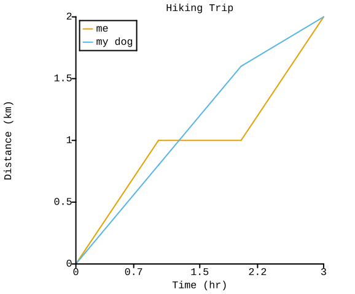

# coloring

`coloring` is a C++ library to do a simple subset of what
the popular Python plotting library [matplotlib](https://matplotlib.org/)
does.
It does not call `matplotlib`, it does not call `gnuplot`, and it has
no external dependencies (`lodepng` is built internally, which also builds `zlib`).

`coloring` exists because there are use cases where you want to generate
nice plots and you prefer not to (or cannot) bring in Python to do it.

Because of its pure C++ nature, `coloring` should be widely portable and
can be used in computing environments with special restrictions where
Python is not readily available.

## Building

`coloring` tries to be a canonical CMake-built package, and the normal
way of building things with [CMake](https://cmake.org/) should work.

## Example

The example executable whose source is found in `example.cpp` and also copied here:

```c++
#include "coloring.hpp"

int main()
{
  std::vector<float> x = {0.0f, 1.0f, 2.0f, 3.0f};
  std::vector<float> me_y = {0.0f, 1.0f, 1.0f, 2.0f};
  std::vector<float> dog_y = {0.0f, 0.8f, 1.6f, 2.0f};
  coloring::plot_dataset me_dataset;
  me_dataset.x = x;
  me_dataset.y = me_y;
  coloring::plot_group me_group;
  me_group.datasets = {me_dataset};
  me_group.name = "me";
  coloring::plot_dataset dog_dataset;
  dog_dataset.x = {x};
  dog_dataset.y = {dog_y};
  coloring::plot_group dog_group;
  dog_group.name = "my dog";
  dog_group.datasets = {dog_dataset};
  coloring::plot_data data;
  data.groups = {me_group, dog_group};
  data.xlabel = "Time (hr)";
  data.ylabel = "Distance (km)";
  data.title = "Hiking Trip";
  data.legend_location = coloring::legend_location::upper_left;
  coloring::plot("example.png", data);
}
```

Should generate the PNG file below:



## How It Works

The `coloring` library gets its name because it is all based on "coloring inside the lines".
In particular, the primitive operation in `coloring` is to fill in the pixels that are inside an outline, where the outline can be a mixture of straight lines and quadratic Bezier curves.
Each pixel is assigned a number between zero and one, which an approximation of how much of that pixel is inside the outline.

The way that number is assigned is based on bounding circles, and treating the outline as a signed distance function.
Given a square in the image, we can compute its bounding circle and ask whether that circle is:

1. fully inside the outline
2. fully outside the outline
3. partially inside the outline

If the bounding circle is only partially inside the outline, we break the square into four smaller squares and ask the question again. This recursion continues until an arbitrary depth (3 levels of recursion) is hit.
At that point, we treat any partly-inside squares as half-filled and tally up the total.

`coloring` uses this primitive "fill in the outline" operation to draw letters, numbers, lines, and dots onto the screen.
Letters and numbers are described by a hardcoded font which is [Liberation Mono](https://www.fontsquirrel.com/fonts/liberation-mono).
This font data describes each letter, number, and special character as a set of straight lines and quadratic Bezier curves.
Each character then is translated into one outline and drawn on the screen.

Drawing a "line" onto the image actually draws an outline which is like a rectangle capped at both ends with circles (the rounded shape that a ballpoint pen would trace on paper).
Drawing a "dot" actually draws a circle.
`coloring` then goes one step further and approximates a circle as four quadratic Bezier curves. This is not a great approximation, but the circles are usually only a few pixels across so the error isn't very noticeable.

With those basic operations we have enough to draw the
X and Y axes, ticks, tick labels, axis tables, plot title, legend outline,
legend entries, and the curves themselves.

`coloring` also uses a system for
assigning default colors to plot members that is based on a set of 8 colors
identified by [Okabe and Ito](https://mikemol.github.io/technique/colorblind/2018/02/11/color-safe-palette.html)
that people with various forms of color blindness can still differentiate.

At Sandia, `coloring` is SCR#2894.0
